# Civitas GraphQL Queries
### This file contains GraphQL queries for the Civitas project.

#### Based on your JSON sample and the Civitas project structure, here are the suggested GraphQL queries divided into logical categories:

 🔐 Access Level Permission (IAM Access Control)
```graphql
query GetAccessLevelPermissions($employeeId: ID!) {
  employee(id: $employeeId) {
    accessLevels {
      id
      name
      departmentId
      departmentName
      roles {
        id
        name
        thirdPartyId
      }
    }
  }
}
```

🏢 Organizational Information
```graphql
query GetOrganizationalInfo($employeeId: ID!) {
  employee(id: $employeeId) {
    employeeDepartment {
      departmentId
      departmentName
      thirdPartyId
    }
    manager {
      id
      firstName
      lastName
    }
    employment {
      jobTitleId
      jobTypeId
      costCenter
      workLocation
      staffCategory
      noticeTimeId
    }
  }
}
```

👤 Personal Information
```graphql
query GetPersonalInformation($employeeId: ID!) {
  employee(id: $employeeId) {
    person {
      id
      firstname
      lastname
      lastname2
      email
      alternateEmail
      gender
      birthdate
      personId
      nationality
      maritalStatus {
        maritalStatusId
        anniversarydate
      }
      educationLevelId
      phonePrivate {
        countryCode
        phone
      }
      phoneMobile {
        countryCode
        phone
      }
      address {
        addressline1
        adressline2
        zip
        city
        country
      }
      nextOfKin1 {
        name
        email
        phone
        relationId
      }
      nextOfKin2 {
        name
        email
        phone
        relationId
      }
    }
  }
}
```

💰 Salary Information
```graphql
query GetSalaryInformation($employeeId: ID!) {
  employee(id: $employeeId) {
    employment {
      salary
    }
    person {
      bankingAccount {
        bankRegistrationNumber
        bankAccountNumber
      }
    }
  }
}
```


📜 Working History
```graphql
query GetWorkingHistory($employeeId: ID!) {
  employee(id: $employeeId) {
    workHistory {
      id
      fromDate
      toDate
      titleId
      departmentId
      departmentName
      superiorId
      superiorName
      jobTypeId
      roleNames
      roleIds
      costCenter
      workLocation
      fte
      salary
      comments
      created
      lastUpdated
    }
  }
}
```
🪪 Access Key Card Data
This combines relevant fields used for generating an access card (e.g., name, photo, department, access roles).

```graphql
query GetAccessKeyCardData($employeeId: ID!) {
  employee(id: $employeeId) {
    person {
      firstname
      lastname
      personId
      photoUrl # Assuming this exists or can be resolved
    }
    employeeDepartment {
      departmentName
    }
    accessLevels {
      name
      roles {
        name
      }
    }
  }
}
```

### Based on your JSON sample and the Civitas project structure, here are the suggested GraphQL queries divided into logical categories:

🔐 Access Level Permission (IAM Access Control)
```graphql
query GetAccessLevelPermissions($employeeId: ID!) {
  employee(id: $employeeId) {
    accessLevels {
      id
      name
      departmentId
      departmentName
      roles {
        id
        name
        thirdPartyId
      }
    }
  }
}
```

🏢 Organizational Information
```graphql
query GetOrganizationalInfo($employeeId: ID!) {
  employee(id: $employeeId) {
    employeeDepartment {
      departmentId
      departmentName
      thirdPartyId
    }
    manager {
      id
      firstName
      lastName
    }
    employment {
      jobTitleId
      jobTypeId
      costCenter
      workLocation
      staffCategory
      noticeTimeId
    }
  }
}
```

👤 Personal Information
```graphql
query GetPersonalInformation($employeeId: ID!) {
  employee(id: $employeeId) {
    person {
      id
      firstname
      lastname
      lastname2
      email
      alternateEmail
      gender
      birthdate
      personId
      nationality
      maritalStatus {
        maritalStatusId
        anniversarydate
      }
      educationLevelId
      phonePrivate {
        countryCode
        phone
      }
      phoneMobile {
        countryCode
        phone
      }
      address {
        addressline1
        adressline2
        zip
        city
        country
      }
      nextOfKin1 {
        name
        email
        phone
        relationId
      }
      nextOfKin2 {
        name
        email
        phone
        relationId
      }
    }
  }
}
```

💰 Salary Information
```graphql
query GetSalaryInformation($employeeId: ID!) {
  employee(id: $employeeId) {
    employment {
      salary
    }
    person {
      bankingAccount {
        bankRegistrationNumber
        bankAccountNumber
      }
    }
  }
}
```

📜 Working History
```graphql
query GetWorkingHistory($employeeId: ID!) {
  employee(id: $employeeId) {
    workHistory {
      id
      fromDate
      toDate
      titleId
      departmentId
      departmentName
      superiorId
      superiorName
      jobTypeId
      roleNames
      roleIds
      costCenter
      workLocation
      fte
      salary
      comments
      created
      lastUpdated
    }
  }
}
```

🪪 Access Key Card Data
This combines relevant fields used for generating an access card (e.g., name, photo, department, access roles).

```graphql
query GetAccessKeyCardData($employeeId: ID!) {
  employee(id: $employeeId) {
    person {
      firstname
      lastname
      personId
      photoUrl # Assuming this exists or can be resolved
    }
    employeeDepartment {
      departmentName
    }
    accessLevels {
      name
      roles {
        name
      }
    }
  }
}
```

#### GraphQL queries in C# using a typical HttpClient and string-based approach. If you're using a library like GraphQL.Client, I can adapt it for that too—just let me know!

🧱 Setup (shared across all queries)
```csharp
public class GraphQLQuery
{
    public string Query { get; set; }
    public object Variables { get; set; }
}

public async Task<string> ExecuteGraphQLQueryAsync(string query, object variables)
{
    using var httpClient = new HttpClient();
    var request = new GraphQLQuery
    {
        Query = query,
        Variables = variables
    };

    var json = JsonSerializer.Serialize(request);
    var content = new StringContent(json, Encoding.UTF8, "application/json");

    // Replace with your actual Civitas GraphQL endpoint
    var response = await httpClient.PostAsync("https://civitas.mycompany.dk/graphql", content);
    response.EnsureSuccessStatusCode();

    return await response.Content.ReadAsStringAsync();
}
```

🔐 Access Level Permission
```csharp
string query = @"
query GetAccessLevelPermissions($employeeId: ID!) {
  employee(id: $employeeId) {
    accessLevels {
      id
      name
      departmentId
      departmentName
      roles {
        id
        name
        thirdPartyId
      }
    }
  }
}";

var result = await ExecuteGraphQLQueryAsync(query, new { employeeId = "550" });
```

🏢 Organizational Information
```csharp
string query = @"
query GetOrganizationalInfo($employeeId: ID!) {
  employee(id: $employeeId) {
    employeeDepartment {
      departmentId
      departmentName
      thirdPartyId
    }
    manager {
      id
      firstName
      lastName
    }
    employment {
      jobTitleId
      jobTypeId
      costCenter
      workLocation
      staffCategory
      noticeTimeId
    }
  }
}";

var result = await ExecuteGraphQLQueryAsync(query, new { employeeId = "550" });
```

👤 Personal Information
```csharp

string query = @"
query GetPersonalInformation($employeeId: ID!) {
  employee(id: $employeeId) {
    person {
      id
      firstname
      lastname
      lastname2
      email
      alternateEmail
      gender
      birthdate
      personId
      nationality
      maritalStatus {
        maritalStatusId
        anniversarydate
      }
      educationLevelId
      phonePrivate {
        countryCode
        phone
      }
      phoneMobile {
        countryCode
        phone
      }
      address {
        addressline1
        adressline2
        zip
        city
        country
      }
      nextOfKin1 {
        name
        email
        phone
        relationId
      }
      nextOfKin2 {
        name
        email
        phone
        relationId
      }
    }
  }
}";

var result = await ExecuteGraphQLQueryAsync(query, new { employeeId = "550" });
💰 Salary Information
```csharp
string query = @"
query GetSalaryInformation($employeeId: ID!) {
  employee(id: $employeeId) {
    employment {
      salary
    }
    person {
      bankingAccount {
        bankRegistrationNumber
        bankAccountNumber
      }
    }
  }
}";

var result = await ExecuteGraphQLQueryAsync(query, new { employeeId = "550" });
```

📜 Working History
```csharp
string query = @"
query GetWorkingHistory($employeeId: ID!) {
  employee(id: $employeeId) {
    workHistory {
      id
      fromDate
      toDate
      titleId
      departmentId
      departmentName
      superiorId
      superiorName
      jobTypeId
      roleNames
      roleIds
      costCenter
      workLocation
      fte
      salary
      comments
      created
      lastUpdated
    }
  }
}";
```
var result = await ExecuteGraphQLQueryAsync(query, new { employeeId = "550" });
🪪 Access Key Card Data
```csharp

string query = @"
query GetAccessKeyCardData($employeeId: ID!) {
  employee(id: $employeeId) {
    person {
      firstname
      lastname
      personId
      photoUrl
    }
    employeeDepartment {
      departmentName
    }
    accessLevels {
      name
      roles {
        name
      }
    }
  }
}";

var result = await ExecuteGraphQLQueryAsync(query, new { employeeId = "550" });
```

Use case fit for a hybrid Redis structure, with the identitykey as the top-level key and logical segments (like personal info, salary, access levels, etc.) stored in a structured and retrievable way under that key.

Let me outline a clean, flexible way to structure this.

🔐 Redis Data Organization
🗝️ Top-level key
The primary Redis key for each person will be:

```css
identity:{identitykey}
```
Example:

```makefile
identity:9f8c89a2-472b-4d2e-b37a-f7c4df21d6bc
```

🧩 Recommended structure: Redis Hash (HSET)
You can store logical segments under this hash using consistent field names, with each value being a raw JSON string.

```bash
HSET identity:9f8c89a2-472b-4d2e-b37a-f7c4df21d6bc \
    access_level_permissions   '{...}' \
    organizational_info        '{...}' \
    personal_info              '{...}' \
    salary_info                '{...}' \
    work_history               '{...}' \
    keycard_info               '{...}'
```
Each field in the hash maps to one of the GraphQL segments, stored as raw JSON to ensure integrity and schema preservation.

📌 Why this is a good fit
Criteria	Why this works
🔁 Reusability	You can fetch a full profile or partial segments (HGET)
⚡ Performance	Redis hashes are very fast for atomic reads/writes
🔒 Data integrity	JSON is stored as-is; no parsing/reassembly across segments
🔍 Logical segmentation	Keeps parts independently updatable or cacheable
🔄 TTL or invalidation	You can expire the hash or parts via app-level logic
🧪 Example in C#
Using StackExchange.Redis:

```csharp
public async Task StoreSegmentAsync(string identityKey, string segmentName, string jsonData)
{
    var db = redis.GetDatabase();
    string redisKey = $"identity:{identityKey}";
    await db.HashSetAsync(redisKey, segmentName, jsonData);
}

public async Task<string?> GetSegmentAsync(string identityKey, string segmentName)
{
    var db = redis.GetDatabase();
    string redisKey = $"identity:{identityKey}";
    return await db.HashGetAsync(redisKey, segmentName);
}
```

Segment names could be constants:

```csharp
public static class IdentitySegments
{
    public const string AccessLevels = "access_level_permissions";
    public const string Organizational = "organizational_info";
    public const string Personal = "personal_info";
    public const string Salary = "salary_info";
    public const string WorkHistory = "work_history";
    public const string Keycard = "keycard_info";
}
```

🛠️ Optional Enhancements
⏳ TTL Support
Set expiry for individual identities if needed:

```csharp
await db.KeyExpireAsync($"identity:{identityKey}", TimeSpan.FromHours(6));
```

📡 Pub/Sub on update
You can publish updates (e.g. via a channel:identity:updates) for consumer services to pick up and react on change.

Summary
Use a Redis hash: identity:{identitykey}

Store each logical GraphQL segment as a JSON string field (e.g., "personal_info", "salary_info")

Enables flexible access, partial updates, integrity preservation.

Can be combined with TTL, pub/sub, or secondary indexes if needed.

```mermaid
graph TD
    A[identity:identitykey]:::hash --> B1[access_level_permissions<br/> JSON ]
    A --> B2[organizational_info<br/> JSON ]
    A --> B3[personal_info<br/> JSON ]
    A --> B4[salary_info<br/> JSON ]
    A --> B5[work_history<br/> JSON ]
    A --> B6[keycard_info<br/> JSON ]

    subgraph Redis Hash [Redis Hash]
        style A fill:#2f3542,stroke:#333,stroke-width:2px
        style B1 fill:#57606f,stroke:#aaa
        style B2 fill:#57606f,stroke:#aaa
        style B3 fill:#57606f,stroke:#aaa
        style B4 fill:#57606f,stroke:#aaa
        style B5 fill:#57606f,stroke:#aaa
        style B6 fill:#57606f,stroke:#aaa
    end
```




---
```yaml
## Notes:
- Each child node under `identity:{identitykey}` represents a GraphQL segment stored as a JSON string.
- The main key in Redis is `identity:{identitykey}`, which could be e.g. `identity:9f8c89a2-472b-4d2e-b37a-f7c4df21d6bc`.
- Stored as a **Redis Hash**, allowing efficient field-level reads/writes.
- Cleanly separated segments to support microservice reads like IAM, HR, Access control, and more.

Would you like me to render this in a visual image as well?
