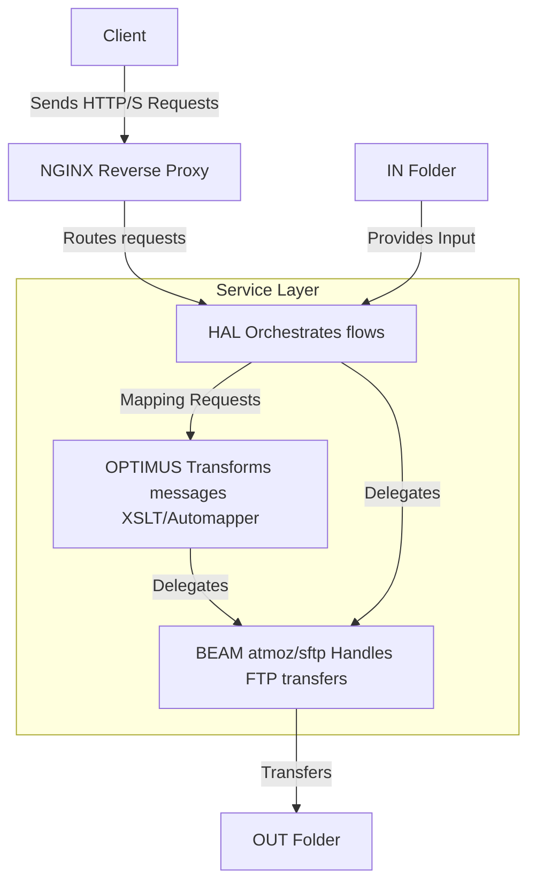

### Steps to Use an SFTP Docker Image with C#

1. **Pull and Run the SFTP Docker Image**:
   You can use the `atmoz/sftp` image to set up an SFTP server. Here's an example command to run the container:

   ```bash
   docker run -d --name sftp-server \
       -p 22:22 \
       -v /path/to/local/files:/home/user/upload \
       atmoz/sftp \
       user:password:1001
   ```

   - Replace `/path/to/local/files` with the local directory you want to use for file storage.
   - Replace `user` and `password` with your desired SFTP credentials.
   - The `1001` is the user ID (UID) for the SFTP user.

2. **Configure the SFTP Server**:
   The `atmoz/sftp` image is highly configurable. You can customize users, permissions, and directories by modifying the Docker run command or using environment variables.

3. **Use C# to Transfer Files**:
   In C#, you can use libraries like **SSH.NET** to interact with the SFTP server. SSH.NET is a popular .NET library for SFTP operations.

   Example C# code to upload a file to the SFTP server:

   ```csharp
   using System;
   using Renci.SshNet;

   class Program
   {
       static void Main()
       {
           var host = "your-sftp-server-ip";
           var port = 22;
           var username = "user";
           var password = "password";

           using (var sftp = new SftpClient(host, port, username, password))
           {
               sftp.Connect();

               var localFilePath = @"C:\path\to\local\file.txt";
               var remoteFilePath = "/home/user/upload/file.txt";

               using (var fileStream = System.IO.File.OpenRead(localFilePath))
               {
                   sftp.UploadFile(fileStream, remoteFilePath);
               }

               Console.WriteLine("File uploaded successfully.");
               sftp.Disconnect();
           }
       }
   }
   ```

   - Replace `your-sftp-server-ip`, `user`, and `password` with your SFTP server details.
   - Replace the local and remote file paths with your actual file locations.

4. **Secure the SFTP Server**:
   - Use strong passwords or SSH keys for authentication.
   - Limit access to the SFTP server using firewall rules or Docker network configurations.
   - Regularly update the Docker image to ensure security patches are applied.

### Alternative SFTP Docker Images
If `atmoz/sftp` doesn't meet your needs, you can explore other SFTP server Docker images, such as:
- **lscr.io/linuxserver/openssh-server**: A more general-purpose SSH/SFTP server.
- **panubo/sshd**: Another lightweight SFTP server image.

By combining a Dockerized SFTP server with C# and libraries like SSH.NET, you can create a secure and programmable file transfer solution.

