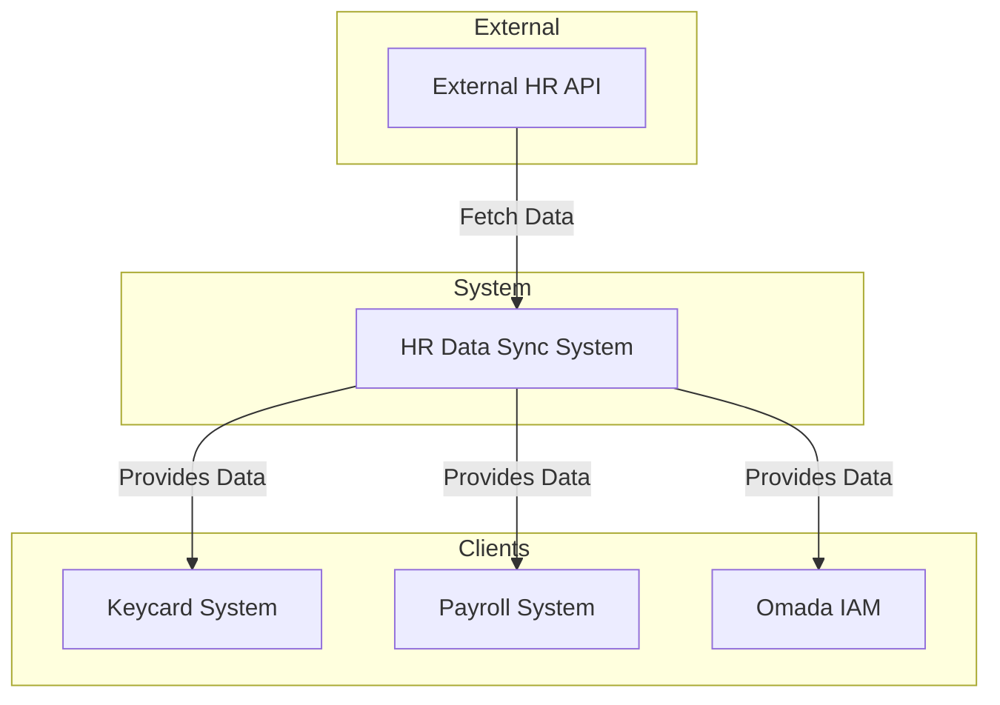
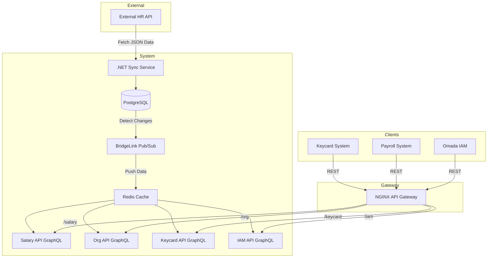
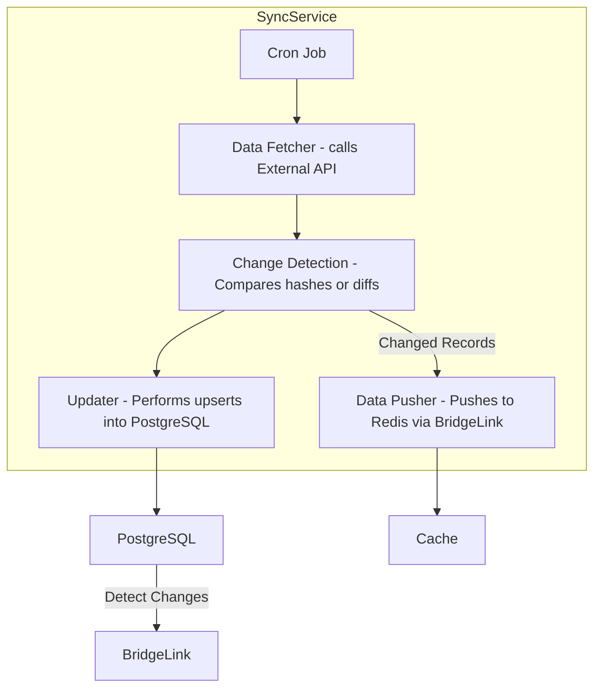
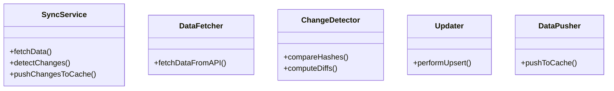

# 🔄 HR Data Sync Architecture

This document describes the high-level architecture and flow for syncing HR data from an external system into our internal services, leveraging PostgreSQL, Redis, BridgeLink Pub/Sub, GraphQL APIs, and NGINX for secure access.

---

## 🕒 1. Scheduled Sync with External Source

- A cron job (e.g., `pg_cron`, system timer, or Kubernetes `CronJob`) triggers a sync 1–2 times daily.
- The job calls an **external HR API** to fetch employee data (e.g., org structure, salary, access control).

---

## 🔍 2. Delta Detection

- **Preferred**: If the source supports **deltas or Change Data Capture (CDC)**, consume those directly.
- **Fallback**: If only full dataset is available:
  - Use **hash comparison** or a **diff engine** after ingestion to identify changes.

---

## 🗃️ 3. Central Database Update (PostgreSQL)

- Insert or update only changed records (using **upserts**).
- Log or mark changed records to enable downstream processing.
- Maintains clean state and enables efficient change propagation.

---

## 🔔 4. Change Push to Redis via BridgeLink Pub/Sub

- A BridgeLink-based pub/sub mechanism listens to PostgreSQL changes.
- Only changed records are **pushed to Redis**, serialized as **JSON**.
- Redis key structure reflects domain logic:
  - `salary:<emp_id>`
  - `org:<dept_id>`
  - `keycard:<emp_id>`
  - `iam:<emp_id>`

---

## ⚙️ 5. GraphQL + REST API Layer

- Redis is the single source of truth for API access.
- Each domain-specific API (e.g., Salary, Org, Keycard, IAM) uses **GraphQL** to query Redis.
- Offers:
  - Flexible client queries
  - Field-specific responses
  - Efficient data access per use case

---

## 🔐 6. Field-Level Access Control

Access to sensitive fields in Redis is strictly controlled via:

- **Attribute-Based Access Control (ABAC)**
- **Scoped JWT tokens** (validated by NGINX gateway)
- **Role-based permission trees** per client type (e.g., HR vs. Security vs. IAM tools)

---

🛠️ Implementation Details
1. Scheduled Data Fetch
Use something like this:

```bash
curl -X GET https://source-system.com/api/hr-data \
     -H "Authorization: Bearer YOUR_TOKEN" \
     -o data.json
```
Store raw data for audit/logging.

Store in staging tables if full snapshots are received.

2. Delta Detection Strategy
Option 1: Use row-level hash or checksum per employee record.

Option 2: Store incoming snapshots and do diff comparison:

```sql

SELECT * FROM incoming_snapshot EXCEPT SELECT * FROM current_data;
```

3. Redis Key Design
Structure Redis like this:

```text
salary:{employee_id}       => JSON { salary, bonus, paygrade }
org:{employee_id}          => JSON { department_id, manager_id }
keycard:{employee_id}      => JSON { active, last_entry, expiry }
iam:{employee_id}          => JSON { roles, permissions, group }
```
4. GraphQL Access Layer
Use a GraphQL server (e.g., Apollo Server or Hot Chocolate in .NET) that:

Maps fields to Redis keys

Applies user- or client-specific field-level restrictions

Example:

```graphql
type Salary {
  base: Int
  bonus: Int
  paygrade: String
}

type Query {
  getSalary(employeeId: ID!): Salary
}
```
Field-level security middleware could look like:

```csharp
Kopiér
Rediger
if (!user.HasAccessTo("bonus")) {
   remove field from JSON or GraphQL response
}
```
5. Data Governance
Log what data was fetched, what changed, and who accessed what in Redis.

Useful for audit trails.

Could be streamed into ELK/Splunk for security visibility.

🔐 Security Considerations
Encrypt sensitive fields before storing in Redis.

Use short-lived tokens with fine-grained scopes.

Field-level access control should be centralized and audited.

Possibly shard Redis data by customer/org if needed for isolation.

Do you have any preferences for:

Tech stack for the GraphQL API?

Specific Redis client library?

How strict you want to be with access control granularity (per field, per record, or both)?

We could even model this in a quick prototype if you'd like.


Using NGINX as a reverse proxy, we can route traffic cleanly to individual APIs behind the scenes. Here's a more concrete prototype design, assuming:

Each API (Salary, Org, Keycard, IAM) is a minimal REST/GraphQL service

Redis is your central high-speed cache for shared employee data

GraphQL is used internally to query Redis and enforce field-level restrictions

NGINX handles HTTPS, routing, and possibly JWT validation via plugin or Lua scripting

🧪 Prototype Design
🔹 Example Stack
Layer	Tech Stack
API Gateway	NGINX (SSL termination, routing, auth check)
APIs	.NET Minimal APIs or NodeJS w/ Express
Data Query Engine	GraphQL (Hot Chocolate for .NET or Apollo)
Cache	Redis (JSON format, key-namespaced)
Storage	PostgreSQL for syncing + change detection
Scheduler	CronJob or Hangfire
📍 Redis Schema Plan
```text

employee:{id}:salary     → { base, bonus, grade }
employee:{id}:org        → { dept_id, manager_id }
employee:{id}:keycard    → { is_active, last_entry }
employee:{id}:iam        → { roles: [...], permissions: [...] }
```
All values are stored as JSON, using RedisJSON (if available).

Each sync only pushes changed records (from PostgreSQL diff).

🔐 Field-Level Access via GraphQL + Claims
Your GraphQL API applies filtering based on JWT claims:

```json
{
  "sub": "client-app-1",
  "scopes": ["salary:view", "org:view"],
  "fields": {
    "salary": ["base", "grade"],
    "iam": []
  }
}
```
The GraphQL resolver uses this to shape output like:

```graphql
query {
  getSalary(employeeId: "123") {
    base
    grade
    # bonus is omitted
  }
}
```

🔁 Sync Logic (High-Level .NET Service)
```csharp
// Called daily or twice-daily
public async Task SyncFromExternalApiAsync()
{
    var externalData = await _httpClient.GetFromJsonAsync<List<Employee>>("https://source/api/hr");
    foreach (var emp in externalData)
    {
        var hasChanged = await _repo.UpsertToDatabaseAsync(emp);
        if (hasChanged)
        {
            await _redisClient.SetJsonAsync($"employee:{emp.Id}:salary", emp.Salary);
            await _redisClient.SetJsonAsync($"employee:{emp.Id}:org", emp.OrgInfo);
            // etc...
        }
    }
}
```
📦 NGINX Routing Config
```nginx
server {
    listen 9443 ssl;
    server_name hr-api.mycompany.dk;

    ssl_certificate     /certs/bridgelink.pem;
    ssl_certificate_key /certs/bridgelink.key;

    location /salary/ {
        proxy_pass http://salary-api:5000/;
    }

    location /org/ {
        proxy_pass http://org-api:5001/;
    }

    location /keycard/ {
        proxy_pass http://keycard-api:5002/;
    }

    location /iam/ {
        proxy_pass http://iam-api:5003/;
    }
}
```
Optional: Add JWT validation with OpenResty/Lua or delegate it to the APIs.

🛠️ GraphQL Example: Hot Chocolate Setup
```csharp
public class SalaryType : ObjectType<Salary>
{
    protected override void Configure(IObjectTypeDescriptor<Salary> descriptor)
    {
        descriptor.Authorize("salary:view"); // Custom directive
        descriptor.Field(f => f.Bonus).Authorize("salary:bonus:view");
    }
}
```
Token scopes determine field visibility.

✅ Next Steps (Suggestion)
✅ Pick a Redis client that supports JSON (e.g., StackExchange.Redis.Extensions)

✅ Choose Hot Chocolate or Apollo for GraphQL

✅ Create Redis serialization contracts for each data slice

✅ Define JWT scopes and field-level policies

✅ Design GraphQL resolvers per slice

✅ Wire up your NGINX routes and test

## 🧭 Architecture Diagram


## Application structure
```bash
Civitas/
│
├── Civitas.Api/                 # API layer (Minimal API)
│   ├── Program.cs               # Entry point with API configuration
│   └── appsettings.json         # Configuration for development/production
│
├── Civitas.Application/         # Application layer (business logic)
│   ├── Interfaces/              # Interfaces for services/repositories
│   └── Services/                # Application services (business logic)
│
├── Civitas.Core/                # Domain layer (Entities, Aggregates, Domain logic)
│   ├── Entities/                # Domain entities (e.g., Employee, Salary)
│   └── Enums/                   # Enums or constants (e.g., AccessLevel)
│
├── Civitas.Endpoints/           # Endpoints layer
│
├── Civitas.Infrastructure/      # Infrastructure layer (data access, external services)
│   ├── Data/                    # EF Core DbContext, migrations, repositories
│   ├── Services/                # External services like email, logging, etc.
│   └── Repositories/            # Data repositories (implementing domain interfaces)
│
├── Civitas.Tests/               # Unit tests, integration tests
│   ├── Application/             # Tests for Application layer
│   ├── Domain/                  # Tests for Domain layer
│   └── Infrastructure/          # Tests for Infrastructure layer
│
├── Civitas.sln                  # Solution file
└── README.md                    # Project overview
```
# C4 model

## 1. Context Diagram (Level 1)

## 2. Container Diagram (Level 2)


## 3. Component Diagram (Level 3)



## 4. Code Diagram (Level 4)
